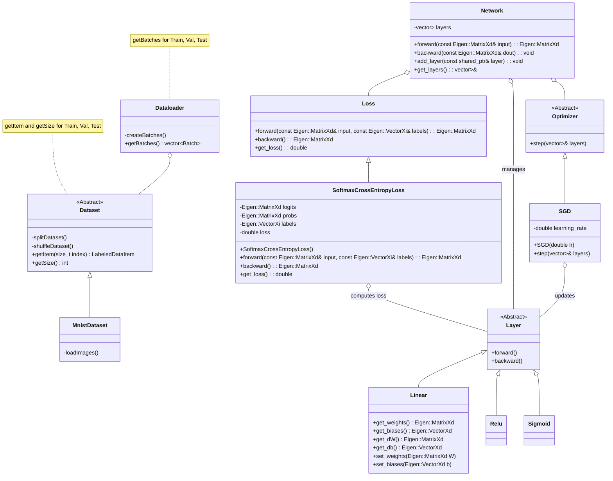

# Deep Learning Project

## Overview
This project implements a fully connected feedforward neural network from scratch in modern C++. It includes essential components like a data loader, layers (e.g., linear, activation), loss functions, an optimizer, and a modular `Network` class.

The main goal is to understand the inner workings of deep learning by re-creating core functionality without relying on high-level libraries. Matrix operations are powered by the [Eigen](https://eigen.tuxfamily.org/) library for performance and simplicity.

## Features
- Fully modular layer-based architecture (OOP)
- Implemented from scratch:
  - Forward & backward propagation
  - Linear, Sigmoid, ReLU, Leaky ReLU
  - Softmax + CrossEntropyLoss
  - SGD optimizer (+ momentum, Adam)
- MNIST PNG loading with custom DataLoader
- Class diagram with `mermaid` for architecture overview
- Unit tests

## Build
### Linux
```bash
cmake -DCMAKE_CXX_COMPILER=g++ -S . -B build
cmake --build build
```
### Windows
```bash
cmake -G "MinGW Makefiles" -DCMAKE_CXX_COMPILER=g++ -S . -B build
cmake --build build
```
### Check Version
Make sure you use version 14.2.0. This should be at top of the output of `cmake -DCMAKE_CXX_COMPILER=g++ -S . -B build`:
```
-- The C compiler identification is GNU 14.2.0
-- The CXX compiler identification is GNU 14.2.0
```

## Test
To test the code run the unit tests via the `build/tests` executable.

## Class Diagramm


## Development Process
This project was developed in three sprints to gradually build, modularize, and optimize a neural network framework from scratch in C++.

### 🟢 Sprint 1: Core Components

- Implemented a simple data loading system to read `.png` images from disk into memory.
- Developed basic forward and backward pass functions for:
  - Linear layer (fully connected layer)
  - Sigmoid activation function

### 🟡 Sprint 2: Modular Object-Oriented Design

This sprint is about structuring the code in a modular fashion to ultimately allow flexible generation of network architectures.

### Sprint 2: Definition of "done"
- Introduced an abstract `Layer` base class with virtual `forward()` and `backward()` methods.
- Derived modular layer classes:
  - `Linear`
  - `Sigmoid`
  - `ReLU`
- Added a `Network` class to manage multiple layers, compute forward and backward passes, and apply parameter updates.
- Implemented a `Loss` abstraction with `SoftmaxCrossEntropyLoss` as a concrete implementation.
- Created an abstract `Optimizer` class and implemented `SGD` (Stochastic Gradient Descent).
- Combined softmax and cross-entropy into a single loss for stability and simplicity.  
  → [More info](https://www.parasdahal.com/softmax-crossentropy)
  
### 🔵 Sprint 3: Code Quality & Performance Improvements

- Replaced manual computations with optimized Eigen operations where possible.
- Used move semantics and best practices for modern C++ performance.
- Added:
  - New activation: Parameterized Leaky ReLU
  - New loss function: Mean Squared Error (MSE)
  - Optimizers: SGD with momentum, Adam
- Improved code structure:
  - Dataloader restructured to use iterators
  - Cleaner class interfaces and modular architecture
- Goal: Achieve at least **30% accuracy** on MNIST with the custom framework 😉
- Result: Up to 90 % :-)
